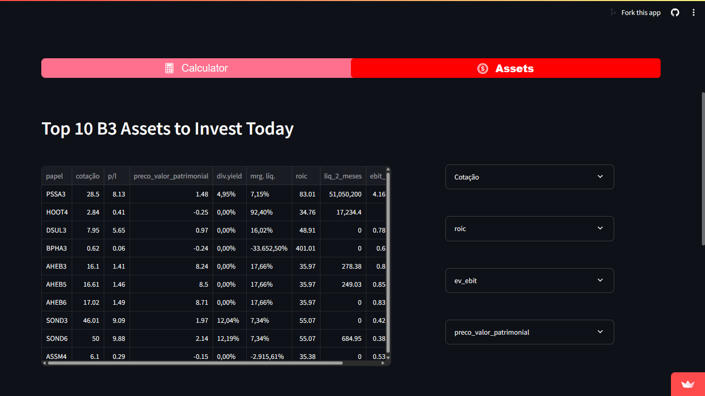

<p align="center">
  <a>
    
  </a>
</p>

<p align="center">
  <a href="https://coinpurse.streamlit.app/">
    
  </a>
</p>

<br>
<p align="center">Practical and portable finance analyst 🪙</p>
<br>
<br>

Tabela de conteúdos
=================
1. [Sobre](#sobre)
2. [Features](#features)
3. [Interface Inicial](#interface-inicial)
4. [Calculadora de Juros Compostos](#calculadora-de-juros-compostos)
5. [Recomendador de Investimentos](#recomendador-de-investimentos)
6. [Histórico de Ações](#histórico-de-ações)
7. [Como rodar localmente](#como-rodar-localmente)
8. [Tecnologias e Ferramentas](#tecnologias-e-ferramentas)
9. [Autores](#autores)

<h4 align="center"> 
	🚧  CoinPurse 🪙 Em construção...  🚧
</h4>

### Sobre <a name="sobre"></a>

...

### Features

- [x] Calculadora de Juros Compostos
- [x] Recomendação de Investimentos
- [x] Histórico de Ações

### Interface Inicial

<p align="center">
  <a>
    
  </a>
</p>
<br>

### Calculadora de Juros Compostos
<p align="center">
  <a>
     </img>
  </a>
</p>
<br>

### Recomendador de Investimentos
<p align="center">
  <a>
    
  </a>
</p>
<br>

### Histórico de Ações
<p align="center">
  <a>
    </img>
  </a>
</p>
<br>

### Como rodar localmente

Caso queira rodar localmente, você irá inicialmente precisar dessas ferramentas instaladas:
[Git](https://git-scm.com), [Python](https://www.python.org/downloads/). 
Além disto é bom ter um editor para trabalhar com o código como [VSCode](https://code.visualstudio.com/)

### 🎲 Rodando Localmente (servidor)

Primeiramente clone o projeto
```bash
# Clone este repositório
$ git clone https://github.com/pedroafmelo/POO_finance.git

# Acesse a pasta do projeto no terminal/cmd
$ cd <caminho/até/POO_finance>
````

Para instalar as dependências, recomendo que primeiro crie um ambiente virtual.
````bash
# Crie o ambiente
python -m venv myenv

# Ative o ambiente
myenv\Scripts\activate
````

Agora pode instalar as dependências
````bash
# Instale as dependências
$ pip install -r requirements.txt
````

Por fim, pode rodar a aplicação
````bash
# Execute a aplicação em modo de desenvolvimento
$ python -m streamlit run app.py

# O servidor inciará na porta:8501 - acesse <http://localhost:8501>
````
<br>

### Tecnologias e Ferramentas

As seguintes ferramentas foram usadas na construção do projeto:

- [Python](https://www.python.org/)
- [Streamlit](https://streamlit.io/)
- [Beatiful Soup](https://beautiful-soup-4.readthedocs.io/en/latest/)
- [Yahoo Finances API](https://pypi.org/project/yfinance/)
- [Pandas](https://pandas.pydata.org/)
<br>
<br>


### Autores

<table>
  <tr>
    <td align="center">
  <a href="https://github.com/pedroafmelo">
    
    <br />
    <sub><b>Pedro Augusto</b></sub>
  </a>
  <br/>
  <b>
  <a href="https://www.linkedin.com/in/pedroafmelo?utm_source=share&utm_campaign=share_via&utm_content=profile&utm_medium=android_app" target="_blank" >
    
  </a>
    <td align="center">
  <a href="https://github.com/ricktherunner">
    
    <br />
    <sub><b>Pedro Henrique</b></sub>
  </a>
  <br />
  <a href="https://www.linkedin.com/in/pedrohmv" target="_blank">
    
  </a>
</td>
    <td align="center">
  <a href="https://github.com/lucasrabay">
    
    <br />
    <sub><b>Lucas Rabay</b></sub>
  </a>
  <br />
  <a href="https://www.linkedin.com/in/lucas-rabay-butcher?utm_source=share&utm_campaign=share_via&utm_content=profile&utm_medium=android_app" target="_blank">
    
  </a>
</td>

</table>

